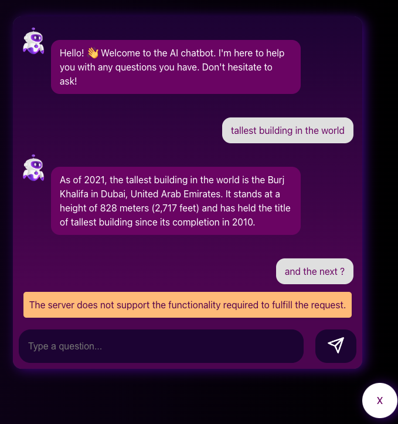
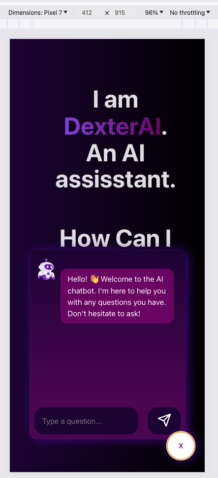

# dexter-AI 🤖
This is a OpenAI powered AI chatbot (with attitude) which uses Elasticsearch to answer already answered questions.

# How to run?
Steps:

1. Install the dependencies for the frontend.
```js
cd client
npm install
```
2. Run the local dev server on frontend
```js
npm run dev
```

Vite builds the app and spins up a local server with HMR capability. Your screen should like this when you visit the link in your terminal:

**Terminal**


**Localhost**


3. Now, on a separate terminal window, install the server dependencies.
```js
cd server
npm install
```

4. Put in the secret token/keys for Elasticsearch and OpenAI.

create a .env in root of the /server with the following content:
```
GCP_ELASTICSEARCH_ENDPOINT='https://5cf64011fb144303be27b23c78b0e8b8.us-central1.gcp.cloud.es.io:443'
GCP_ELASTIC_CLOUD_ID='80e29e79cc5044c48f55d8fa0c678551:dXMtY2VudHJhbDEuZ2NwLmNsb3VkLmVzLmlvJDVjZjY0MDExZmIxNDQzMDNiZTI3YjIzYzc4YjBlOGI4JDI4MmZiZDUyZGQ5NzRiODU5Y2RlNWMwZTViYWU4MThm'
GCP_ELASTIC_CLOUD_AUTH_KEY='dG9RdnJZNEJUb0REXzJyVDgyd1g6M1FDSG5ka2hSYjYxeXpxeFhoSjhVdw=='
```

OPENAI_API_KEY='YOUR_API_KEY'

Note:
The 'GCP_ELASTIC' keys are only valid until April 14,2024.

To create your own `GCP_ELASTIC_CLOUD_ID`, `GCP_ELASTICSEARCH_ENDPOINT` and `GCP_ELASTIC_CLOUD_AUTH_KEY`, do the following:
- Go to 'https://cloud.elastic.co/home'.
- Start your free trial of 14 days.
- This will create your `GCP_ELASTIC_CLOUD_ID`, `GCP_ELASTICSEARCH_ENDPOINT`.
- Go to Elastic->Search home

Click on `New` button to generate your own API_KEY:


Next, To create your OpenAI key do the following:

- Go to: https://platform.openai.com/api-keys
- Sign in. 
- Click on Api keys from the Nav bar, and click 'Create New secret key'


4. Run the backend express app
```js
npm start
```
You should see the server running, with 'nodemon' watching 👁️


5. Once you have successfully placed the key values in the `.env`, that's it, now start asking questions to `Dexter` and how dextrous is it! 🧠

# Frontend
This app uses Vite + React minimal setup with HMR and some ESLint rules.

Uses 2 official plugins:

- [@vitejs/plugin-react](https://github.com/vitejs/vite-plugin-react/blob/main/packages/plugin-react/README.md) uses [Babel](https://babeljs.io/) for Fast Refresh
- [@vitejs/plugin-react-swc](https://github.com/vitejs/vite-plugin-react-swc) uses [SWC](https://swc.rs/) for Fast Refresh

For more info:
https://vitejs.dev/

## Installation
```js
npm install
```

## Run the local dev server
```js
npm run dev
```

# Backend
The 'server' folder comprises the Node and Express backend for this application.

# installation
```js
npm install
```

# run
```js
npm start
```

# run (debug mode)
```js
  DEBUG=server:* npm start
```

## Features
### Rate limiting
This chatbot rate-limits, does not allow more than 3RPM(requests per minute).


### Loader
It disables further hitting the apis, if the bot is fetching the answer


### Error Handling
Gracefully handles the api errors. Below, it handles a `500 internal server` error.
 


### BOT with attitude
Since it uses openAI under the hood, it has an 'attitude'.


### responsive UI design
Chat-bot is:
 - in `closed` state in mobiles `onLoad`


 - in `open` state in tabs and laptops `onLoad`
 

## Responsiveness on devices:
### Pixel 7




### iPhone14 pro max


### iPad Pro


